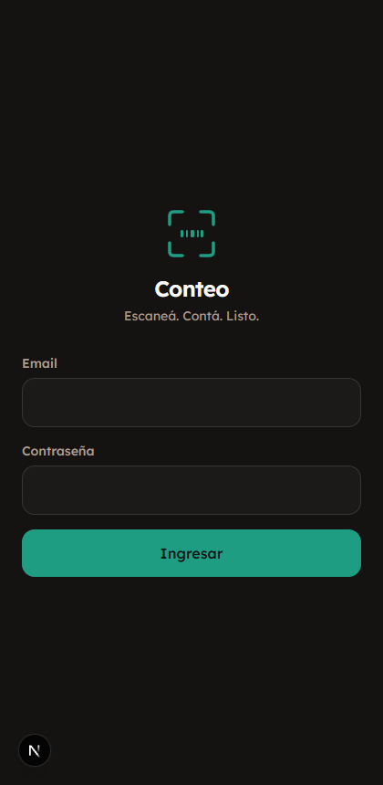
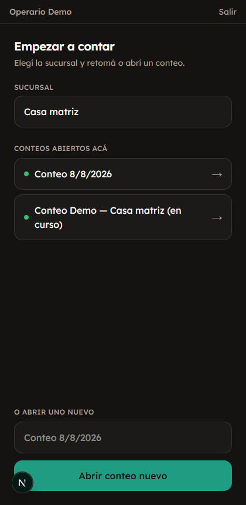
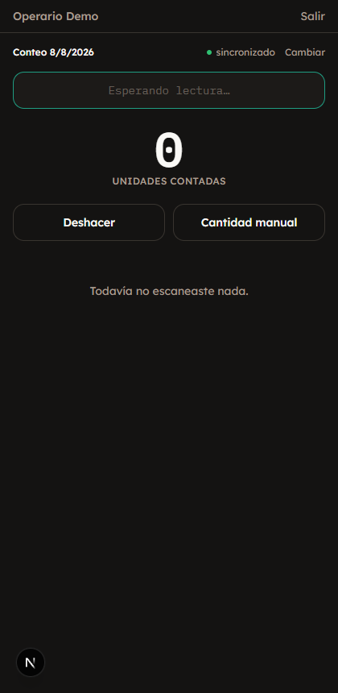
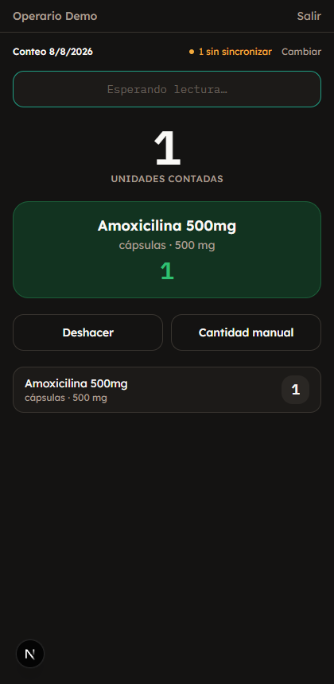

# Sistema de Inventario Farmacéutico

Sistema de conteo de inventario para farmacias, multi-empresa y multi-sucursal. Dos aplicaciones separadas que comparten el mismo backend de Supabase:

- **`apps/conteo`** — PWA para el conteo físico de stock con lector de código de barras Bluetooth desde un celular Android. Funciona sin internet. La usa el empleado que cuenta.
- **`apps/admin`** — panel de escritorio para importar catálogo, revisar productos no identificados y ver el resumen gerencial. La usan admin, gerente y superadmin.

## Stack

- Next.js (App Router) + TypeScript + Tailwind, monorepo con pnpm workspaces
- Supabase: Postgres, Auth, Storage, Realtime, RLS — un solo proyecto compartido por ambas apps
- Dexie (IndexedDB) para el catálogo offline y la cola de escaneos en `apps/conteo`
- n8n + Gemini para identificar por foto los productos que no están en el catálogo (opcional)

## Requisitos previos

- Node.js 20+ y [pnpm](https://pnpm.io) 9.15+
- Un proyecto de [Supabase](https://supabase.com) (plan gratuito alcanza para empezar)
- Para el conteo real: un lector de código de barras Bluetooth que funcione como teclado (HID) y mande Enter al terminar de leer — cualquier celular Android con Chrome sirve como terminal
- Opcional: una instancia de [n8n](https://n8n.io) si vas a usar identificación automática por foto

## Instalación

### 1. Clonar e instalar dependencias

```bash
git clone <este-repositorio>
cd Farmacia
pnpm install
```

### 2. Crear el proyecto en Supabase

Creá un proyecto nuevo en [supabase.com](https://supabase.com/dashboard). Vas a necesitar, del panel **Project Settings → API**:

- `Project URL`
- `anon public` key
- `service_role` key (⚠️ nunca la expongas en código de cliente ni la subas a git)

### 3. Variables de entorno

Copiá el mismo bloque de variables en **ambas** apps:

`apps/admin/.env.local` y `apps/conteo/.env.local`:

```bash
NEXT_PUBLIC_SUPABASE_URL=https://tu-proyecto.supabase.co
NEXT_PUBLIC_SUPABASE_ANON_KEY=tu-anon-key
SUPABASE_SERVICE_ROLE_KEY=tu-service-role-key
```

Las tres son necesarias en las dos apps: `apps/conteo` usa la `service_role` key en el route handler que recibe el callback de la IA (`/api/desconocidos/callback-ia`), y `apps/admin` la usa en el panel de superadmin para crear usuarios.

### 4. Aplicar las migraciones

Las migraciones viven en `supabase/migrations/`, numeradas y pensadas para correr **en orden**, una sola vez. Desde el **SQL Editor** de tu proyecto Supabase, pegá y ejecutá el contenido de cada archivo en este orden:

1. `20260806000000_tenancy.sql` — empresas, sucursales, usuarios, RLS base
2. `20260806000001_catalogo_conteo.sql` — catálogo, conteos, desconocidos, RLS
3. `20260806000002_funciones_rpc.sql` — funciones de escaneo y normalización de código de barras
4. `20260806000003_importacion_abm.sql` — importación de catálogo por Excel
5. `20260806000004_funciones_importacion.sql`
6. `20260806000005_conteos_rls.sql`
7. `20260806000006_desconocidos_storage.sql` — bucket de fotos + identificación por IA
8. `20260806000007_cierre_resumen.sql` — cierre de conteo y resumen gerencial
9. `20260806000008_desconocidos_conteo_origen.sql`
10. `20260806000009_superadmin_rls.sql` — panel de superadmin

Todas usan `create table`/`create policy` sin `if not exists`, a propósito: si una falla a mitad de camino, mejor un error ruidoso que un esquema a medias corriendo en silencio.

### 5. Crear el primer superadmin

Con las migraciones aplicadas, no hay todavía ninguna empresa ni usuario. El primer superadmin se crea a mano, una única vez, desde el SQL Editor (después de esto, el resto de las empresas/sucursales/usuarios se administran desde `/superadmin` en `apps/admin`):

```sql
-- 1. Creá el usuario desde Authentication → Users → Add user en el
--    dashboard de Supabase (con email y contraseña). Copiá su UUID.

-- 2. Creá una empresa y el perfil de superadmin para ese usuario:
insert into empresas (nombre) values ('Tu empresa') returning id;
-- usá el id que te devuelve arriba:
insert into perfiles (id, nombre, empresa_id, rol)
values ('UUID-DEL-USUARIO', 'Tu nombre', 'ID-DE-LA-EMPRESA', 'superadmin');
```

Con eso ya podés entrar a `apps/admin`, ir a **Superadmin** y crear el resto de las empresas, sucursales y usuarios desde la interfaz.

### 6. Configurar la identificación por foto (opcional)

Si vas a usar la identificación automática de productos desconocidos por IA:

1. Levantá una instancia de n8n e importá `n8n/flujo-desconocidos-ia.json`.
2. Configurá ahí la credencial de Gemini.
3. Desde `apps/admin`, entrá a **Superadmin → (tu empresa)** y cargá la URL del webhook y el secreto compartido en la sección "Identificación de desconocidos por IA".

Si no lo configurás, el resto del sistema funciona igual — los productos no identificados quedan pendientes para resolver a mano desde la bandeja de revisión.

## Correr en desarrollo

```bash
pnpm dev:admin    # apps/admin  en http://localhost:3000
pnpm dev:conteo   # apps/conteo en http://localhost:3001
```

Se corren por separado, en dos terminales — no hay un comando que levante las dos juntas a propósito, porque en operación real corren en dispositivos distintos (`apps/admin` en una computadora, `apps/conteo` en el celular del empleado que cuenta).

## Build de producción

```bash
pnpm build   # compila las dos apps
pnpm lint    # eslint en las dos apps
```

Cada app se despliega por separado (por ejemplo en Vercel, un proyecto por app). Recordá configurar las mismas variables de entorno de la sección 3 en cada deploy.

## Estructura del proyecto

```
apps/
  admin/     — panel de escritorio (Next.js)
  conteo/    — PWA de conteo (Next.js)
packages/
  db/        — cliente de Supabase, tipos, funciones RPC compartidas
supabase/
  migrations/ — el esquema completo, en orden
n8n/
  flujo-desconocidos-ia.json — workflow de identificación por foto (opcional)
docs/
  decisiones.md — bitácora de decisiones técnicas de todo el proyecto, fase por fase
```

---

## Guía rápida para el empleado que cuenta

Esto es lo que necesita saber quien usa `apps/conteo` en el celular durante un conteo físico. No hace falta que lea nada de lo anterior.

### 1. Entrar

Abrí la app en el navegador del celular y entrá con el usuario y contraseña que te dio tu administrador.



### 2. Elegir sucursal y conteo

Elegí la sucursal donde estás parado. Si ya hay un conteo abierto en esa sucursal, entrá a ese — si no, abrí uno nuevo con un nombre que lo identifique (por ejemplo, la fecha).



### 3. Esperar la descarga del catálogo

La primera vez que entrás a un conteo, la app baja todo el catálogo al celular. Esto tarda unos segundos y **solo hace falta una vez por conteo** — después, escanear funciona sin internet.



### 4. Escanear

Apuntá el lector al código de barras y apretá gatillo (o escribilo a mano y Enter si no tenés lector). El campo de arriba siempre tiene que estar listo para leer — no toques la pantalla entre lectura y lectura.

- **Verde** = producto encontrado, sumó 1 unidad.
- Si volvés a escanear el mismo código, suma de nuevo (no hace falta tocar nada).
- Si el código no está en el catálogo, la app te va a pedir una foto del producto para identificarlo después.
- **Deshacer** saca la última lectura si te equivocaste.
- **Cantidad manual** sirve para cargar una cantidad exacta de una sola vez (por ejemplo, si contaste una caja cerrada y sabés que trae 30 unidades, en vez de escanear 30 veces).



### 5. Cerrar

Vos no cerrás el conteo — eso lo hace tu administrador desde `apps/admin` cuando ya terminaste. Mientras tanto, fijate que arriba diga **"sincronizado"** antes de irte: si dice "N sin sincronizar", esperá a tener señal antes de cerrar la app.

---

Para el detalle técnico de cada decisión de diseño tomada durante el desarrollo (por qué se eligió tal enfoque, qué se probó y cómo, qué límites quedaron documentados), ver [`docs/decisiones.md`](docs/decisiones.md).
